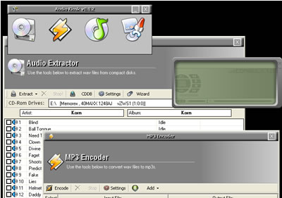

<div align="center">

## Audio Kiosk v0\.9\.4 \[Updated 6/24/04\]


</div>

### Description

Another update to Audio Kiosk. Many more bugs fixed, some new features, lots of changes, etc. Please see the changelog in the read me or on the holder site for more information on changes.

Audio Kiosk is an easy to use, fully featured program to extract, encode, and play media.

Features, include, but are not limited to:

A. Extraction:

- Rip directly to WAV, MP3, or both.

- CDDB Querying

- Editable ID3 tags

- Automatically parsing files to directories based on Artist and Album

B. Encoding

- Ability to customize the most important settings with regard to Encoding (ie. bitrate, vbr, mode, etc) or use presets [NOTE: these settings also affect extraction to MP3]

- Easy to use interface which allows you to create a list of WAVs then encode the list, instead of having to pick each file one at a time.

C. Media Player

- Skins

- Visualizations

- ID3 viewing/editing

- Many media files supported including mp3, wav, ogg vorbis, wma, etc

- Custom Sound Studio, which allows you to tweak the audio to your heart's content

D. General

- Kiosk mode to lock down the rest of the computer [NOTE: the term "lock down" is used very loosely!]

- Every section of Audio Kiosk can be password protected to block unwanted access to certain features

- Usage of system tray icon to be more user-friendly

- And much, much more!

Much of the code used in Audio Kiosk came from submissions to PSC. I tried my best to give full credit in both the readme and the about dialog of the program.

NOTE: The website on the about screen is non-existent... so don't even bother. ;)
 
### More Info
 


<span>             |<span>
---                |---
**Submitted On**   |
**By**             |[Jason Schnitzler](https://github.com/Planet-Source-Code/PSCIndex/blob/master/ByAuthor/jason-schnitzler.md)
**Level**          |Advanced
**User Rating**    |4.8 (19 globes from 4 users)
**Compatibility**  |VB 6\.0
**Category**       |[Complete Applications](https://github.com/Planet-Source-Code/PSCIndex/blob/master/ByCategory/complete-applications__1-27.md)
**World**          |[Visual Basic](https://github.com/Planet-Source-Code/PSCIndex/blob/master/ByWorld/visual-basic.md)
**Archive File**   |[](https://github.com/Planet-Source-Code/jason-schnitzler-audio-kiosk-v0-9-4-updated-6-24-04__1-54330/archive/master.zip)


### Source Code

```
The code can be downloaded from:
http://blake.prohosting.com/webmech
```

